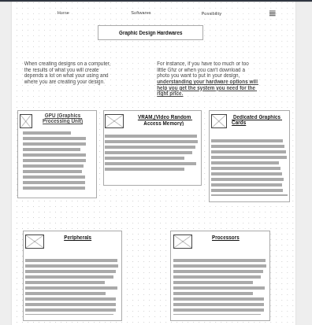

# Making The Freedom Project Website
##### 5/5/2025

### Where I am at Now
Throughout these months, I have been starting make a layout of my Freedom Project Website as well as coding the basic layout on my index.html. I did this by usin the tool that I have been learning how to use called <a href="https://bulma.io/">Bulma.io</a>, a modern CSS framework that has similar components to <a href="https://getbootstrap.com/docs/5.3/getting-started/introduction/">Bootstrap</a>. To make the layout of my website, I created a layout of what my website would look like on <a href="https://wireframe.cc/">Wireframe.cc</a>, which I used when starting to code out my basic layout of my Freedom Project Website. 

### Challenges
Throughout the process of creating the website, I have encounted many challenges when coding out the website. For instance when I was trying align the content according to the wireframe outline shown below, the two columns on top did not properly align when the screen was at desktop width. At the time, I was not able to ask for help because I was working on this after an event at church, so I had to figure out on my own how to properly align my content. Originally I was using <strong>Columns</strong> to adjust the content to what I needed, which was more difficult than I thought it be to use. Due to this, I switched over to using Bulma's <strong>Grid System</strong> in order to adjust my content to how I wanted. Being with how it worked on the hardware page, I decided to use this `<div class="cell is-col-min-32-desktop  has-1-cols-mobile has-text-weight-light` again on the software page so it can be easier and less time consuming to adjust my content. 


Another challenge that I went through was correcting an image issue on my website. In my website, I had created images to the side of these bulma mixins that I used on ther bottom of my software and hardware pages. 
In my original code, I used `../` which is taking up one directory, thinking that the website will correctly find the images that I need. 


```
<div class="box"> <--div class I used for each mixin---->
                  <div class="bulma-clearfix-mixin">
                    
                    <p>GPU (Graphics Processing Unit)</p>
                  </div>
 <p>This piece of hardware is responsible for processing vast amounts of graphical data in a computer</p>
</div>
```
I was confused as to why this issue was occuring, that was when I asked Mr.Mueller after class about the issue, and he said that implementing a `../` <strong>was not necessary</strong> because my webpages are already on the main of of my repo. Which means that I did not need to go up one directory to find the images I need to put in my website. 

### Skills I learned 
From this experience, I learned how to <strong> properly debug code on my own</strong> as well as <strong> break my tasks down into smaller pieces</strong> so that it can be easier for me to focus on what I am doing and what I need to do. 


### EDP
I am currently on stage seven of the Engineering Design Process, which is to <strong>Improve as Needed.</strong> On one of the last few weeks that I had to make the website, my classmates were looking over each others websites to see what we can improve on in our websites. From this, we add on to our beyond <strong>MVP(Minimum Viable Product)</strong> so that we can further develop and improve our website based on what our peers said about it. 


### Final Thoughts and Takeaways
I am a bit nervous because soon I am going to have to present my website to students with different grades and I often get stage freight.  At the same time, I am also excited that I can have the oppertunity to present the project that I have worked on hard throughout this year!


[Previous](entry05.md) | [Next](entry07.md)

[Home](../README.md)
